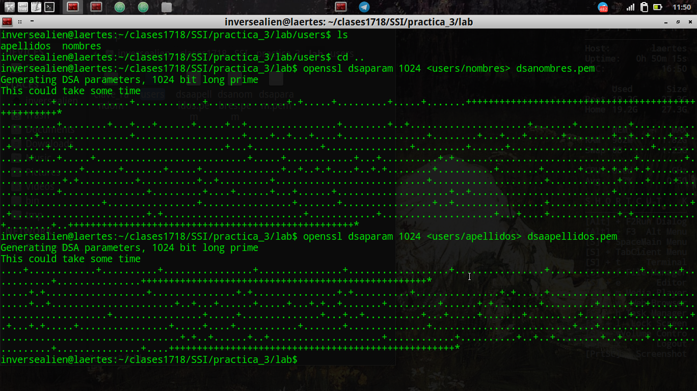

# Seguridad y protección en Sistemas Informáticos
## Práctica 3

Para esta práctica trabajamos con el concepto de protocolos, y para ello utilizamos openssl con dgst y dsa. Para generar las claves pem de nombre y apellidos de los usuarios, yo he creado dos archivos "nombres" y "apellidos" en una subcarpeta de "users" y he recuperado los parámetros desde ahí.

Para ello utilizo los comandos:

    openssl dsaparam 1024 <users/nombres> dsanombres.pem
    openssl dsaparam 1024 <users/apellidos> dsaapellidos.pem

Detalle más ampliado del contenido de nombres y apellidos:

    #cat users/nombres
    John
    ALice

    #cat users/apellidos
    Doe
    Dou

Para extraer la clave privada de nombres usaremos gendsa con clave. Es decir:

    openssl gendsa dsanombres.pem -out dsanombre_priv.pem -passout pass:prueba
    openssl gendsa dsaapellidos.pem -out dsaapellidos_priv.pem -passout pass:prueba

Para extraer la clave pública usaremos -pubout, es decir:

    openssl dsa -in dsanombre_priv.pem -pubout -out dsanombre_pub.pem
    openssl dsa -in dsaapellidos_priv.pem -pubout -out dsaapellidos_pub.pem

Para calcular el Hash con sha384, haremos uso de dgst en openssl. Es decir:

    openssl dgst -out nombreDSApub.sha384 -sha 384dsanombre_pub.pem

Y el para el algoritmo de 160 b, he usado SHA1, es decir:

    openssl dgst -out nombreDSApub.sha1 -sha1 dsanombre_pub.pem

Para generar HMAC con clave 12345 y que me muestre el contenido, he usado:

    echo -n "value" | openssl dgst -hmac "12345"
